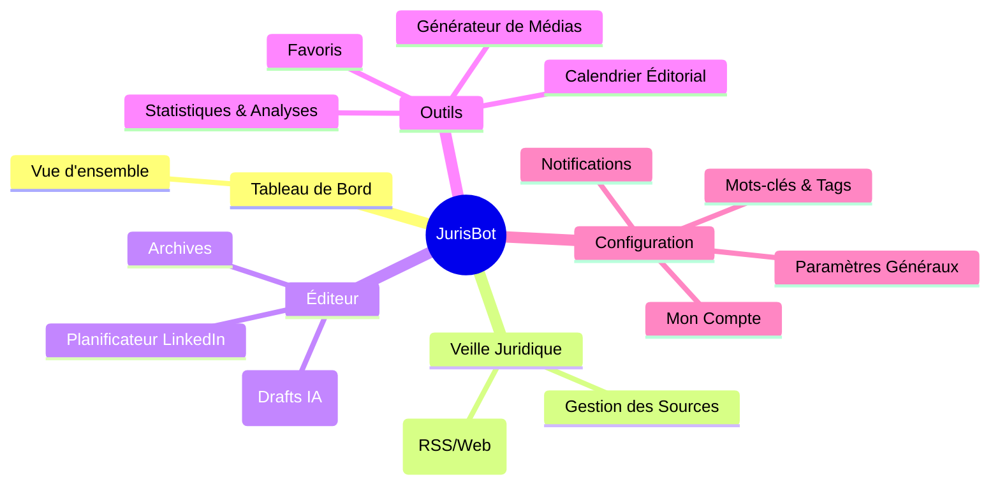

# JurisBot v2 - Proposition Globale & Spécifications

Ce document présente la vision complète de l'application **JurisBot**, avec l'arborescence détaillée (Site Map) et le fonctionnement des workflows, intégrant les dernières demandes (Stats LinkedIn, Carrousels PDF, Notifications).

## 1. Arborescence de l'Application (Site Map)

L'interface sera organisée avec un menu latéral (Sidebar) structuré comme suit :

---

## 2. Détail des Fonctionnalités par Rubrique

### 🏠 Tableau de Bord (Vue d'ensemble)
*   **KPIs Rapides** : Nombre d'articles détectés ce jour, posts prêts à publier.
*   **Planning du Jour** : Liste des posts programmés pour la journée.
*   **Dernières Activités** : Flux récent des actions.

### ⚖️ Veille Juridique
*   **Flux des Sources** : Liste consolidée des articles.
    *   *Nouveau* : Sélection multiple pour envoi vers "Éditeur".
*   **Gestion des Sources** : Ajout d'URL (RSS ou Site Web).

### ✍️ Éditeur & Création (Interface "Studio")
Basé sur votre maquette, l'écran sera divisé en 3 zones interactives :

1.  **Zone IA (Haut Gauche)** :
    *   **Résumé Juridique** : Affichage du résumé généré par Gemini.
    *   **Actions** : Boutons "Reformuler" (nouveau tirage IA) et "Copier dans l'éditeur".
2.  **Zone Édition (Bas Gauche)** :
    *   **Rich Text Editor** : Pour personnaliser le texte du post.
    *   **Média** : Bouton "Ajouter un média" (Import ou Génération Banana).
    *   **Actions Fin** : "Enregistrer en Brouillon" ou "Planifier".
3.  **Zone Latérale (Droite)** :
    *   **Aperçu Mobile (LinkedIn)** : Simulation temps réel du rendu (Texte + Carrousel/Image).
    *   **Planification** : Sélecteur de Date/Heure avec **suggestion d'horaire** pour "Meilleur engagement".

#### Fonctionnalités Spécifiques :
*   **Studio Média** :
    *   **Génération d'Image** : Création d'illustrations via **Banana.dev** (ou Gemini Nano).
    *   **Générateur de Carrousel** : Génération série d'images -> Fusion en PDF.
    *   **Rédaction IA** : L'IA rédige le post LinkedIn avec **Choix du Ton** (ex: Professionnel, Polémique, Pédagogique, Humoristique).
    *   **Studio Média (Nouveau)** :
        *   **Génération d'Image** : Création d'illustrations via **Banana.dev** (ou Gemini Nano) pour des rendus haute qualité.
        *   **Import d'Image** : Upload manuel par l'utilisateur.
        *   **Générateur de Carrousel** :
            1.  Génération d'une série de 5-10 images (Banana).
            2.  **Conversion automatique en PDF** (Format requis par LinkedIn pour les carousels).
            3.  Post prêt à être publié.
*   **Planificateur LinkedIn** : Vue calendrier (Drag & Drop).
*   **Archives** : Historique complet.

### 🔔 Notifications
*   **Centre de Notifications (UI)** :
    *   **Icône Cloche** : Présente dans le header (accessible depuis toutes les pages).
    *   **Alertes** : Badge rouge pour les nouveaux articles « À traiter » ou les nouveautés fonctionnelles.
*   **Digest Matinal (Email)** :
    *   Envoi automatique (ex: 7h30) d'un résumé des articles détectés.
    *   **Contenu** : Titre + Résumé court + Lien source.
    *   **Call-to-Action** : Bouton vers le Dashboard.

### 🛠️ Outils
*   **Statistiques LinkedIn (Nouveau)** :
    *   Tableau de bord dédié aux performances des posts.
    *   Métriques : Impressions, Taux d'engagement, Likes, Commentaires.
    *   *Nécessite* : Connexion API LinkedIn valide.
*   **Calendrier** : Vue mensuelle de la stratégie éditoriale.
*   **Favoris** : Articles mis de côté.

### ⚙️ Configuration
*   **Paramètres** : Réglages de l'application.
*   **Mots-clés & Tags** : Définition des tags et mots-clés de veille.
*   **Mon Compte** : Profil utilisateur.

---

## 3. Workflows d'Automatisation (n8n)

### 🔄 Workflow 1 : "Veille & Notification" (Matin)
1.  **Trigger (7h00)** : Déclenchement quotidien.
2.  **Scraping** : Scan des sources actives.
3.  **Résumés Courts** : Gemini génère un mini-résumé pour chaque article.
4.  **Email Digest** : n8n compile la liste et l'envoie par email à l'utilisateur.

### 🔄 Workflow 2 : "Transformation & Création" (À la demande)
*(Déclenché quand l'utilisateur clique sur "Générer Post" depuis le Dashboard)*
1.  **Analyse Profonde** : Gemini analyse l'article complet.
2.  **Rédaction** : Création du brouillon LinkedIn (Hook, Corps, Hashtags).
3.  **Média (si demandé)** :
    *   **Image Simple** : Prompt -> API Banana -> Image (.png).
    *   **Carrousel** : Prompt -> API Banana (x5 images) -> **Merge PDF Node** -> Fichier PDF final.

---

## 4. Suggestions & Améliorations Futures

### 🧠 Intelligence Artificielle Avancée
1.  **Analyse de Sentiment** : Détection de la tonalité des articles juridiques.
2.  **Score de Viralité** : Prédiction de l'impact.

### � Idées "Nice to Have" (Hors V1)
3.  **Extension Chrome "JurisBot Clipper"** : (Mis de côté pour l'instant) Pour ajouter manuellement une page web à la veille.
4.  **Mode "Focus"** : Interface d'écriture épurée.
5.  **Contre-Argument** : Proposition d'un angle "Contre" pour susciter le débat.

---

## 5. Modèle de Données (Mise à jour v2)

Pour supporter ces nouvelles fonctionnalités, nous ajouterons :

*   **Table `media_assets`** : `id`, `url`, `type` (image/pdf), `article_id`, `prompt_used`.
*   **Table `user_preferences`** : `email_digest_enabled`, `digest_time`, `linkedin_access_token`.
*   **Table `stats_linkedin`** : `post_id`, `impressions`, `likes`, `comments`, `date`.
